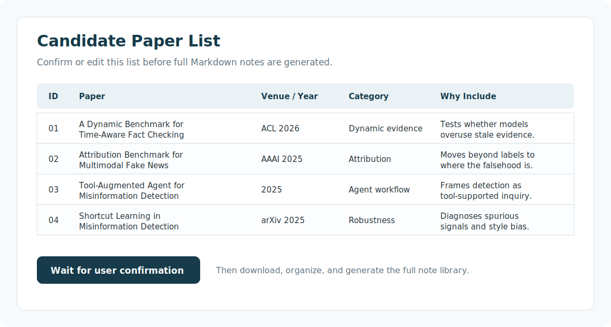
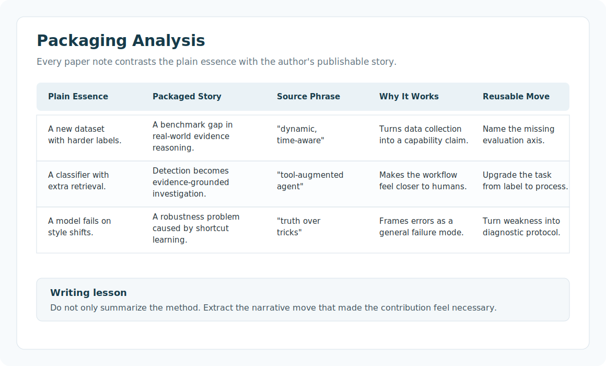

# My Skills

This is a collection of skills I use for research writing, paper polishing,
small AI experiments, MATLAB work, and coding-agent workflows.

As a communication engineering student, I organize this skill collection around
learning and research at the intersection of computer science, communication
engineering, and AI-assisted experimentation.

## What's Inside

Skills are organized by topic:

| Folder | Purpose |
|---|---|
| `skills/research-writing` | Paper writing, rewriting, citation-aware manuscript work, and publication figures. |
| `skills/research-ideation` | Brainstorming research ideas and finding new angles. |
| `skills/research-artifacts` | Recording research provenance, compiling notes/logs, reviewing rigor, and building structured paper-reading note libraries. |
| `skills/experiment-ml` | Running small ML experiments, fine-tuning, evaluation, tracking, and GPU feasibility checks. |
| `skills/matlab` | MATLAB coding, testing, debugging, apps, databases, signal processing, and visualization. |
| `skills/engineering` | Coding-agent workflows for implementation, review, debugging, GitHub, TDD, PRDs, and issues. |
| `skills/productivity` | Handoffs, teaching, grilling plans, and writing better skills. |
| `skills/design` | Frontend design guidance. |
| `skills/writing-polish` | Prompt improvement and human-style writing polish. |

## Quickstart

1. Install from GitHub with a skill manager that supports GitHub repositories:

```bash
npx skills@latest add PNemo04/My_skills
```

2. Pick the skills you want and the coding agent you want to install them into.

3. For manual installation, copy any `skills/<category>/<skill-name>` directory
   into your agent's skill folder.

4. Review machine-specific templates before use, especially `gpubox` and GitHub
   SSH workflows.

See [CHANGELOG.md](CHANGELOG.md) for repository updates.

## Featured Skill: research-paper-notes

`research-paper-notes` is a workflow skill for turning a research topic or a set
of papers into a navigable Markdown reading-note library. It is designed for
three jobs I repeatedly need while doing research:

- selecting papers around a topic instead of reading randomly;
- producing a survey-style `notes/README.md` that links to detailed notes for
  every paper;
- studying how authors package their work, not only what the method does.

The key difference from a normal paper summarizer is the packaging analysis.
Each per-paper note must compare the plain underlying contribution with the
story the authors use to make it publishable, including short source phrases
that are useful for learning research writing.



### Supported inputs

Use it in three modes:

| Input mode | What the skill does |
|---|---|
| Specific paper titles, PDFs, or links | Builds notes directly around the provided papers. |
| A topic or research direction | Searches recent/top-tier/high-impact papers, proposes a candidate list, then waits for confirmation. |
| Your own manuscript | Reads the manuscript, infers the closest topic and comparison space, then proposes related papers. |

For topic-based tasks, the skill has a mandatory confirmation gate: it first
lists candidate papers with venue/year, category, reason for inclusion, and
links. Full notes are generated only after the user confirms or edits the list.

### Output structure

By default, it creates a library like this:

```text
papers/
  01_category_name/
  02_category_name/
notes/
  README.md
  papers/
    01_short_slug.md
    02_short_slug.md
.paper_text/
```

The overview note contains a research map, paper table, cross-paper comparisons,
Mermaid diagrams when useful, writing-pattern summaries, and possible research
directions. Each per-paper note includes method details, experiment details,
limitations, future ideas, and a required packaging section.



### Example prompts

```text
Use $research-paper-notes to build a paper-reading note library for
misinformation detection. Start by listing candidate papers for confirmation.
```

```text
Use $research-paper-notes. I will give you 12 paper titles; organize them into
categories, download/read what you can, and generate Markdown notes.
```

```text
Use $research-paper-notes on my manuscript. Infer the related topic, propose a
paper list first, and emphasize writing/packaging lessons in the final notes.
```

## Skill Index

`\*` marks original skills or templates from my own workflow.

### Research Writing

- [paper-spine](skills/research-writing/paper-spine/SKILL.md) - Write, rewrite, or build a paper or report (journal, conference, report, review, competition) end to end, then output LaTeX/PDF/Word.
- [ml-paper-writing](skills/research-writing/ml-paper-writing/SKILL.md) - Write publication-ready ML/AI papers for NeurIPS, ICML, ICLR, ACL, AAAI, COLM.
- [academic-plotting](skills/research-writing/academic-plotting/SKILL.md) - Generates publication-quality figures for ML papers from research context.

### Research Ideation

- [brainstorming-research-ideas](skills/research-ideation/brainstorming-research-ideas/SKILL.md) - Guides researchers through structured ideation frameworks to discover high-impact research directions.
- [creative-thinking-for-research](skills/research-ideation/creative-thinking-for-research/SKILL.md) - Applies cognitive science frameworks for creative thinking to CS and AI research ideation.

### Research Artifacts

- [compiler](skills/research-artifacts/compiler/SKILL.md) - Compile papers, repositories, logs, code, or notes into a structured Agent-Native Research Artifact.
- [research-manager](skills/research-artifacts/research-manager/SKILL.md) - Record research decisions, experiments, dead ends, claims, and provenance after a session.
- [rigor-reviewer](skills/research-artifacts/rigor-reviewer/SKILL.md) - Review research artifacts for evidence quality, falsifiability, scope, coherence, exploration integrity, and rigor.
- [research-paper-notes](skills/research-artifacts/research-paper-notes/SKILL.md) \* - Build topic-centered paper-reading note libraries with a survey overview, per-paper deep notes, and writing/packaging analysis.

### Experiment & ML

- [gpubox](skills/experiment-ml/gpubox/SKILL.md) \* - Run or feasibility-check ML experiments on a personal idle GPU computer reached over SSH.
- [accelerate](skills/experiment-ml/accelerate/SKILL.md) - Simplest distributed training API.
- [bitsandbytes](skills/experiment-ml/bitsandbytes/SKILL.md) - Quantizes LLMs to 8-bit or 4-bit for 50-75% memory reduction with minimal accuracy loss.
- [lm-evaluation-harness](skills/experiment-ml/lm-evaluation-harness/SKILL.md) - Evaluates LLMs across 60+ academic benchmarks (MMLU, HumanEval, GSM8K, TruthfulQA, HellaSwag).
- [ml-training-recipes](skills/experiment-ml/ml-training-recipes/SKILL.md) - Battle-tested PyTorch training recipes for all domains — LLMs, vision, diffusion, medical imaging, protein/drug discovery, spatial omics, genomics.
- [peft](skills/experiment-ml/peft/SKILL.md) - Parameter-efficient fine-tuning for LLMs using LoRA, QLoRA, and 25+ methods.
- [swanlab](skills/experiment-ml/swanlab/SKILL.md) - Provides guidance for experiment tracking with SwanLab.
- [unsloth](skills/experiment-ml/unsloth/SKILL.md) - Expert guidance for fast fine-tuning with Unsloth, LoRA, and QLoRA.

### MATLAB

- [matlab-add-awgn](skills/matlab/matlab-add-awgn/SKILL.md) - Add Additive White Gaussian Noise (AWGN) noise and convert between SNR, Eb/No, Es/No, and per-subcarrier SNR for communications simulations.
- [matlab-agentic-toolkit-setup](skills/matlab/matlab-agentic-toolkit-setup/SKILL.md) - Install and configure the MATLAB Agentic Toolkit — detect MATLAB, install the MCP server, register with your AI coding agent, and verify the environment.
- [matlab-build-app](skills/matlab/matlab-build-app/SKILL.md) - Build MATLAB apps programmatically using uifigure, uigridlayout, UI components, callbacks, and uihtml for web integration.
- [matlab-create-live-script](skills/matlab/matlab-create-live-script/SKILL.md) - Create plain-text MATLAB Live Scripts (.m files) with rich text formatting, LaTeX equations, section breaks, and inline figures.
- [matlab-debugging](skills/matlab/matlab-debugging/SKILL.md) - Diagnose MATLAB errors and unexpected behavior.
- [matlab-design-digital-filter](skills/matlab/matlab-design-digital-filter/SKILL.md) - Design and validate digital filters in MATLAB.
- [matlab-display-image](skills/matlab/matlab-display-image/SKILL.md) - Display images and annotations for image processing, computer vision, and visual inspection.
- [matlab-install-products](skills/matlab/matlab-install-products/SKILL.md) - Deterministic workflow to download MATLAB Package Manager (mpm) and install MathWorks products from the OS command line with consistent, repeatable behavior.
- [matlab-list-products](skills/matlab/matlab-list-products/SKILL.md) - Show all installed MATLAB products and support packages for a given MATLAB installation folder.
- [matlab-map-database-objects](skills/matlab/matlab-map-database-objects/SKILL.md) - Generates MATLAB Object Relational Mapping (ORM) code using Database Toolbox.
- [matlab-model-serdes-systems](skills/matlab/matlab-model-serdes-systems/SKILL.md) - Model, simulate, and optimize serializer/deserializer systems in MATLAB.
- [matlab-modernize-code](skills/matlab/matlab-modernize-code/SKILL.md) - Modernize deprecated MATLAB functions and improve MATLAB code compatibility.
- [matlab-read-database](skills/matlab/matlab-read-database/SKILL.md) - Reads data from relational databases using MATLAB Database Toolbox pushdown capabilities.
- [matlab-review-code](skills/matlab/matlab-review-code/SKILL.md) - Review MATLAB code for quality, performance, maintainability, and adherence to MathWorks coding standards.
- [matlab-testing](skills/matlab/matlab-testing/SKILL.md) - Generate and run MATLAB unit tests using matlab.unittest and matlab.uitest.
- [matlab-use-duckdb](skills/matlab/matlab-use-duckdb/SKILL.md) - Generates MATLAB code for DuckDB database operations using Database Toolbox.
- [matlab-write-database](skills/matlab/matlab-write-database/SKILL.md) - Writes data from MATLAB to relational databases and performs database operations.

### Engineering

- [ask-matt](skills/engineering/ask-matt/SKILL.md) - Ask which skill or flow fits your situation.
- [code-review](skills/engineering/code-review/SKILL.md) - Review a branch, PR, or work-in-progress diff against coding standards and the requested spec.
- [codebase-design](skills/engineering/codebase-design/SKILL.md) - Shared vocabulary for designing deep modules.
- [diagnosing-bugs](skills/engineering/diagnosing-bugs/SKILL.md) - Diagnosis loop for hard bugs and performance regressions.
- [domain-modeling](skills/engineering/domain-modeling/SKILL.md) - Build and sharpen a project's domain model.
- [github-codex-key](skills/engineering/github-codex-key/SKILL.md) \* - Use a configured GitHub SSH key safely from Codex or another coding agent.
- [github-ssh-key-push](skills/engineering/github-ssh-key-push/SKILL.md) \* - Push a local git repository to GitHub through a dedicated SSH key.
- [implement](skills/engineering/implement/SKILL.md) - Implement a piece of work based on a PRD or set of issues.
- [improve-codebase-architecture](skills/engineering/improve-codebase-architecture/SKILL.md) - Scan a codebase for deepening opportunities, present them as a visual HTML report, then grill through whichever one you pick.
- [prototype](skills/engineering/prototype/SKILL.md) - Build a throwaway prototype to answer a design question.
- [setup-matt-pocock-skills](skills/engineering/setup-matt-pocock-skills/SKILL.md) - Configure this repo for the engineering skills — set up its issue tracker, triage label vocabulary, and domain doc layout.
- [tdd](skills/engineering/tdd/SKILL.md) - Test-driven development.
- [to-issues](skills/engineering/to-issues/SKILL.md) - Break a plan, spec, or PRD into independently-grabbable issues on the project issue tracker using tracer-bullet vertical slices.
- [to-prd](skills/engineering/to-prd/SKILL.md) - Turn the current conversation into a PRD and publish it to the project issue tracker — no interview, just synthesis of what you've already discussed.
- [triage](skills/engineering/triage/SKILL.md) - Move issues and external PRs through a state machine of triage roles — categorise, verify, grill if needed, and write agent-ready briefs.

### Productivity

- [grill-me](skills/productivity/grill-me/SKILL.md) - A relentless interview to sharpen a plan or design.
- [grill-with-docs](skills/productivity/grill-with-docs/SKILL.md) - A relentless interview to sharpen a plan or design, which also creates docs (ADR's and glossary) as we go.
- [grilling](skills/productivity/grilling/SKILL.md) - Interview the user relentlessly about a plan or design.
- [handoff](skills/productivity/handoff/SKILL.md) - Compact the current conversation into a handoff document for another agent to pick up.
- [teach](skills/productivity/teach/SKILL.md) - Teach the user a new skill or concept, within this workspace.
- [writing-great-skills](skills/productivity/writing-great-skills/SKILL.md) - Reference for writing and editing skills well — the vocabulary and principles that make a skill predictable.

### Design

- [frontend-design](skills/design/frontend-design/SKILL.md) - Guidance for distinctive, intentional visual design when building new UI or reshaping an existing one.

### Writing Polish

- [humanizer](skills/writing-polish/humanizer/SKILL.md) - Revise AI-generated prose so it reads more naturally and less mechanically.
- [prompt-optimizer](skills/writing-polish/prompt-optimizer/SKILL.md) \* - Optimize, strengthen, rewrite, audit, or improve LLM prompts.

## How To Use

Use the skills with any agent or tool that understands `SKILL.md` directories.
The `.claude-plugin/plugin.json` file lists all included skills for tools that
support Claude Code-style skill plugins.

For manual use, copy the skill directory you want into your agent's skill
folder, or install/import this repository with your skill manager if it supports
GitHub repositories.

## Notes

This repository contains both my own small templates and skills originally
created by other people or projects; I sincerely thank the original creators
for sharing their work.

If you reuse this repository, please review each skill before running it. Some
skills are templates that expect you to fill in your own paths, hostnames,
environment names, or project-specific details.

## License

MIT
